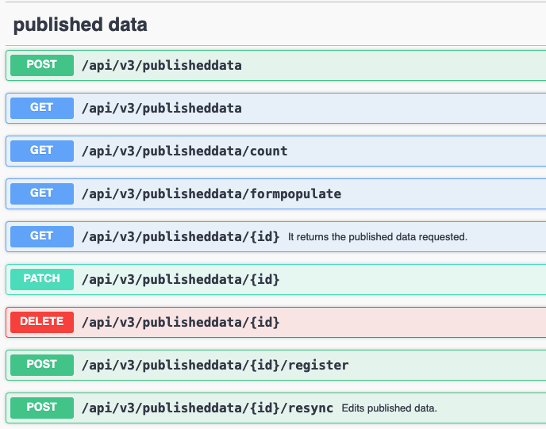

# DOI minting in SciCat - How to set up publication of datasets

## Introduction
User introduction can be found [here](../doisIntro.md).

## Variables to configure

We repeat here the relevant parts from the [```.env```-file](../backendconfig/index.md#environment-variables) that essentially give handle to the admin-user:

* REGISTER_DOI_URI="https://mds.test.datacite.org/doi"
* REGISTER_METADATA_URI="https://mds.test.datacite.org/metadata"
* DOI_USERNAME="username"
* DOI_PASSWORD="password"

The up to now main landing page server as separate frontend client will become redundant: other than datasets can be chosen as entry points to benefit from the nice search on datasets, one can simply use also the publishedData main page as entry point for displaying all externaly accessible DOIs.

## Full potential with SciCat's APIs

The respective endpoints can be viewed from swagger and are

List of API endpoints one can access:


### Endpoints

#### post 
Main one is to the post object:


Others are

#### count 


#### register


#### form populate


#### resync

