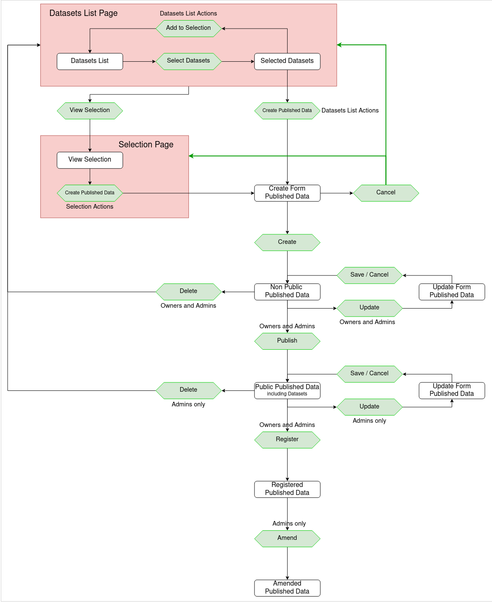

# Publishing SciCat datasets Advanced

The previously described options to [publish datasets](Publishing.md) in SciCat - the process of registration of a selection of datasets - is here outlined in a more technical way.

## Implementation workflow target

Please note only metadata is stored in SciCat, there is no direct coupling between the software and the storage system. If you wish to publish both the metadata and data, please speak to your operator or consult the developer documentation for examples.

### 1. Create a list of selected datasets
You can select datasets to create a **dataset list**; more datasets can be added and removed in several sessions. You can cancel the process at any time. New will be that while examining single datasets he can directly add or remove them to or from the selection in the cart. Before proceeding, you will be asked to verify the selection of datasets. You as user have finalized the dataset selection for which you want to register the dataset with a DOI.

##### Internal review (to be implemented)
Some institutions may introduce an internal review step at this point: other authenticated user (as part of a dedicated reviewer-group) review the selected datasets. If OK, proceed to next form and the initial you can continue the DOI minting process.

### 2. Fill the form for this dataset selection 
You will be forwarded to a form where you provide **metadata specific to this selection** already conform to DataCite metadata fields to match site specific information about e.g. grants, associated projects, etc. All selected datasets will be made public. Owners (and Admins) are allowed to update this form. Again, this shall be possible within several sessions.

### 3. Publish the selection
After hitting button all selected datasets become publicly visible: not only the owner can view all the metadata of the data, date of creation, associated files names, location, PI, etc. This is **prerequisite** for DOI registration.  

### 4. DOI registration
Before hitting the registration button the data selection does have an "internal" DOI which is an unregistered DOI clearly indicated by the state of this registration request.
When hitting the button register all the meta data will be forwarded to DOI provider DataCite if configured, see [backend config](../backendconfig/dois.md). For quality control your site may run in between an external service before forwarding the request. *Pending request* is indicated until the request if forwarded to DataCite. Note, from then on no more changes are possible for the requester. The concept of DOIs is to never change the metadata/data of the DOI.

### 5. For Admins only
In extremely rare cases and only if justified, i.e. in case of great errors an update can be made by admins only.

