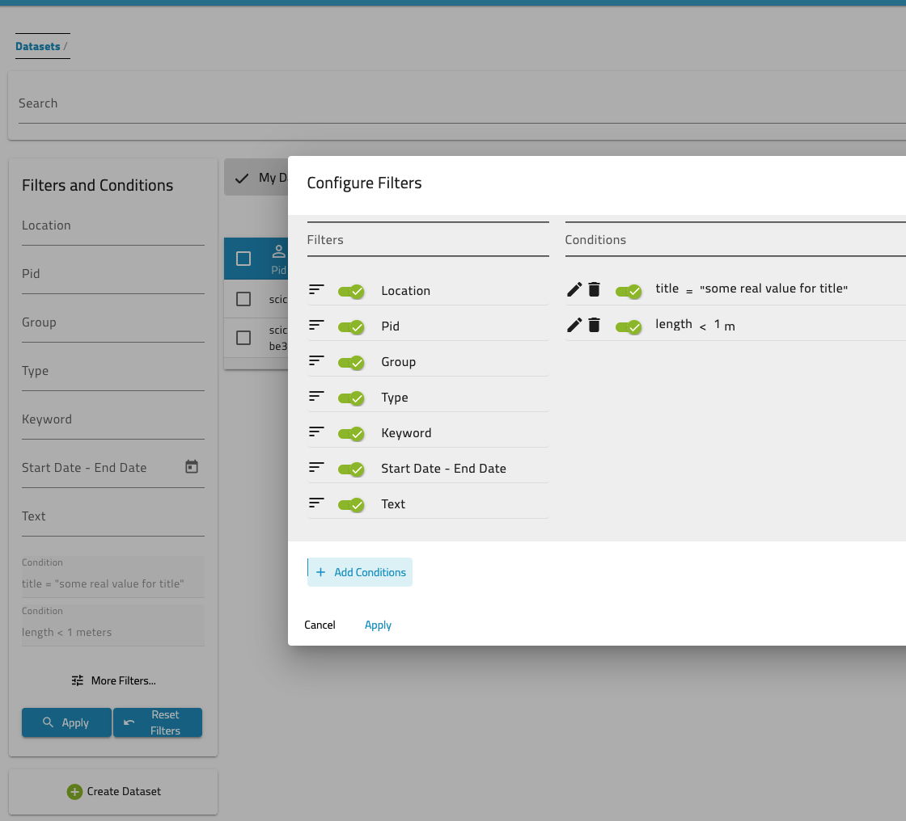

## Finding Datasets
SciCat provides several possibilities for finding the right datasets. You can use the top search bar, you can narrow down your selection by applying filters and/or conditions and the user can search on scientific metadata as well.

### Using Filters and Conditions
On the left you can apply most common filters. Currently there are

1. Location: location of creation of the dataset.
2. PID: Identifier of the dataset.
3. Groups: who owns the dataset.
4. Type: data type - e.g. raw data or derived data.
5. Keywords: tags added to the dataset.
6. Start - End Date: show datasets captured between the dates that you have set.
7. Text: which searches across dataset name and description.

The text fields provide an auto completion, which becomes visible as you type. 

You can click on the date calendar to select the start date and a second to select end date. Make sure you select 2 dates.

You can configure the selection of filters and add specific _conditions_. An example shows two additional conditions added:

## View Details
To view a dataset simply click on it in the table and a more detailed view will load (this is covered in the datasets section)