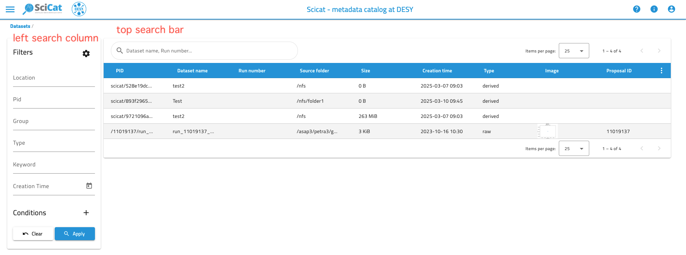
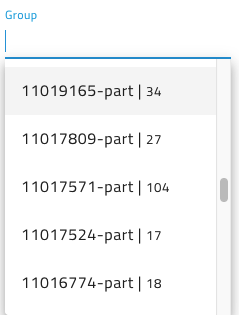
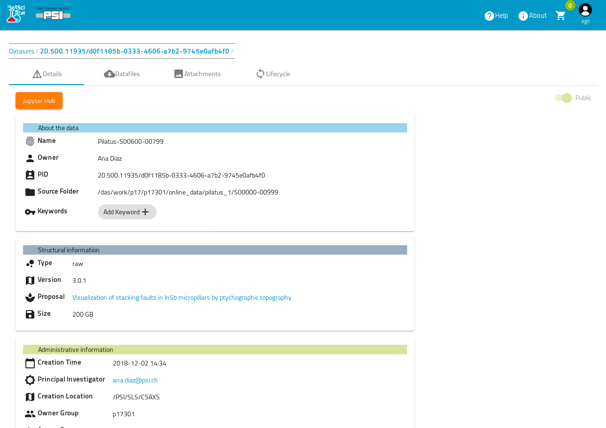
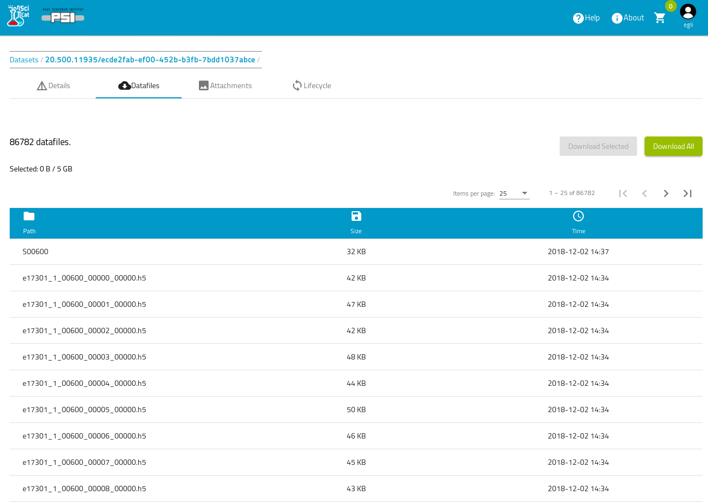
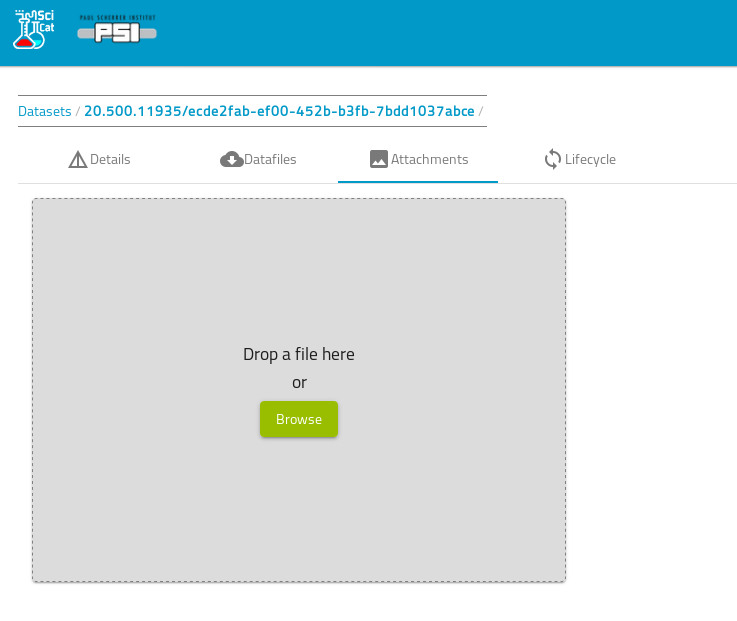
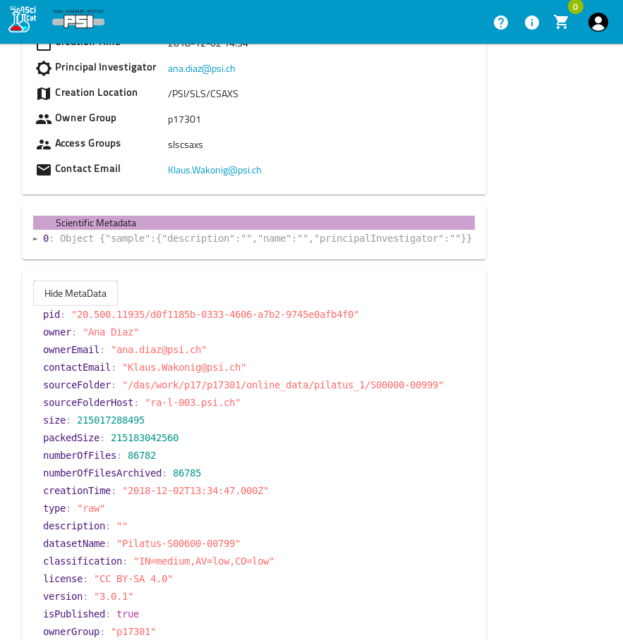
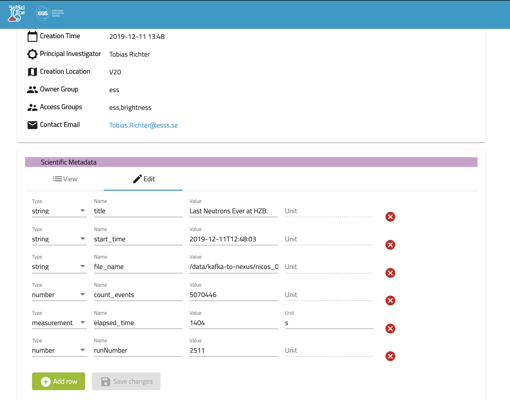

# Datasets
SciCat datasets are sets of metadata and can include several files which e.g. comprise a self-contained measurement - which is fully customizeable during ingestion of metadata. Users can search and view different formats (e.g. in tree, tables or as JSON) of the dataset and list them. 

## How to search for datasets
Datasets can be queried in several places and ways, genereally to get an overview or to narrow down your datasets of interests.
We have the **left filter column** and the **top search bar**, both query directly the mongo database, so filters generally need to be exact. Partial string search are also possible from the top bar on titles and descriptions only.

[](img/datasets_SearchingInSciCat.png)

Advanced users can also use the API, either from [Swagger](../swagger/index.md) or [commandline](queries_curl.md) some examples.

### Left search column: Filters
One can filter for six criteria of which if you hoover or click there it shows directly the number of available datasets matching. 

* `Location`: string that tells about where the dataset was created.
* `PID`: identifier of the dataset
* `Group`: groups that show your access to the datasets
* `Type`: usually raw or derived. In SciCat one can define also your own type of dataset, e.g. "summary".
* `Keyword`: also known as tags
* `Creation Time period`: select start and end dates of the creation of the datasets
* `Conditions`: they contain scientific metadata

You need to hit <span style="color:blue">Clear</span> to reset the filter, even for search criteria set in the top bar. When ready, hit <span style="color:blue">Apply</span> . Note by clearing, one also resets the value in the top bar.

Use filters when you know *exact* values, e.g. the ```pid``` or a certain period of time. 
Before entering any values SciCat already shows what is available merely by clicking into one of the fields:

[](img/datasets_FilterPreview.png)

### Left search column: Conditions
You can also define your own condition on the datasets, e.g. on a range of energy - depending on your scientific metadata defined.
Note, the available operators are fixed and not applicable to each field. Also nested values are not yet accessible for the search.

### Top search bar
If you first would like to get an idea of what is available for you, use this top bar search. Then you can apply more refined filters and conditions. Partial string search from either title or description of the dataset is available from here. Note, some characters are evaluated in a peculiar way, e.g. the "_", you should not end with these characters even though the string as such is included. 

Example: use `mfn` instead `mfn_` despite the dataset names contain `mfn_`.

## Features
Before ingesting or during the analysis of the data, one can use a very handy feature to **group and tag** datasets. Read [here](grouping_tagging_ds.md) for more details how to group them using tags (`Keywords`). 

Datasets can also be selected for **several actions**:
One such action is the *publication* of that selection. For more details see [publication of SciCat datasets](Publishing.md).
Generally, actions depend on what is implemented at your site and can cover a wide range from selecting many and make one new of *custom type* [(see advanced documentation)](../datasets/datasetTypes.md) to using that selection of datasets to *run an analysis* on them. Depending on your configuration, you see a button to select your dataset in concern that you can **Add to Selection** (formerly *Add to Cart*) and do whatever is defined at your site. 

One will see this button either from the dataset list view or on the dataset details view (recent).


## Dataset details
The main tab shows the details of a dataset. 



## Dataset file listing
A dataset can have several associated files to it. They can be listed by clicking on the tab **Datafiles** just right to the Details tab:



## Dataset attachments
Another tab is for the attachements of a dataset, e.g. PNG or TIFF images.



Simply follow the instructions to upload an image. The size is restricted to be below 16 MB.

## View raw JSON data

Scientific meta data is shown in JSON under its section and looks like this:


## Get raw JSON data

One can also get the JSON file via the swagger API. If set up, one can directly access the API endpoints of SciCat backend. Usually the address is in the form: ```my-scicat-instance.country/explorer```, swagger is accessible via the explorer. One needs to authenticate by copying the token from the GUI into the field **authorize**, then find the dataset of interest, by trying it out it will display you dataset and you can download it in JSON format.

## Edit Scientific meta data
If enabled, fields in the scientific metadata can be modified and edited by any member of the [Owner Group](../backendconfig/authorization/authorization_datasets.md) of the data by hitting the "Edit" Icon. The user can add, remove or change metadata fields, every change will create a new record in the databse with it's history [feature is soon available again from 2025-07-02].


