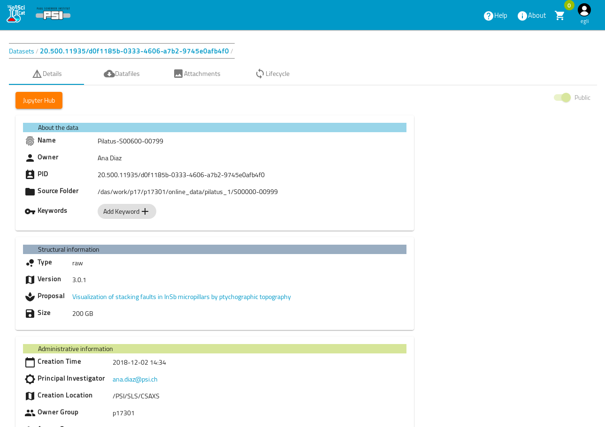
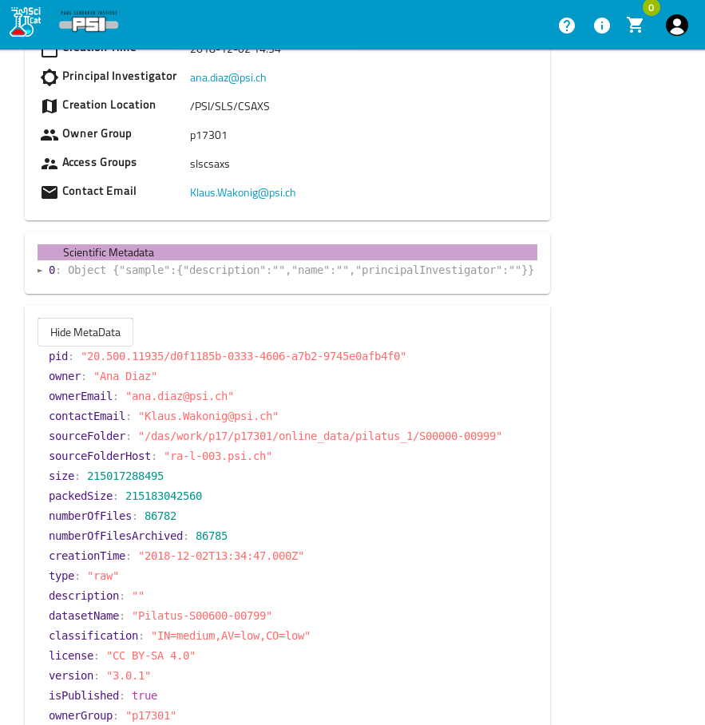

# Datasets
SciCat datasets are sets of metadata and can include several files which e.g. comprise a self-contained measurement - which is fully customizeable during ingestion of metadata. Users can search and view different formats (e.g. in tree, tables or as JSON) of the dataset and list them. 

## Features
* A very handy feature is to group and tag datasets. Find [here](grouping_tagging_ds.md) more details how to do it. 
* Datasets can also be selected for several actions. One such action is the *publication* of that selection. For more details see [publication of SciCat datasets](Publishing.md). Generally, actions depend on what is implemented at your site and can cover a wide range from comprising them into a new datacollection of a custom type to using that selection of datasets to run an analysis on them.

## How to search for datasets
You can use several places to query your datasets: 

* from the top the search bar and
* from the filter & conditions column on the left. You can customize your filters and conditions, adjust the filters to those that you find interesting and you can define your own conditions making use of your specific scientific metadata.

The bar looks like this:


Filtering and condtions can be applied like that. On the very left one sees this column:


 If you chose "More Filters" a pop-up window appears where you can chose which of the filters you want to display. You can also add your own conditions as well (visible in the background under conditions):


## Dataset details
The main tab shows the details of a dataset.



## Dataset file listing
A dataset can have several associated files to it. They can be listed by clicking on the tab **Datafiles** just right to the Details tab:


## Dataset attachments
Another tab is for the attachements of a dataset, e.g. pngs or tifs


Simply follow the instructions to upload an image. The size is restricted to be below 16 MB.

## View raw JSON data

Scientific meta data is shown in JSON under its section and looks like this:


## Get raw JSON data

One can also get the JSON file via the swagger API. If set up, one can directly access the API endpoints of SciCat backend. Usually the address is in the form: ```my-scicat-instance.country/explorer```, swagger is accessible via the explorer. One needs to authenticate by copying the token from the GUI into the field **authorize**, then find the dataset of interest, by trying it out it will display you dataset and you can download it in JSON format.

## Edit Scientific meta data
If enabled, fields in the scientific metadata can be modified and edited by the owner of the data by hitting the "Edit" Icon. The user can add,remove or change metadata fields, every change will create a new record in the databse with it's history [feature is soon available again from 2025-07-02].


### New developments on dataset types
Generalize datatypes to remove restrictions of ```raw``` and ```derived``` types.

[datasetTypes](../datasets/datasetTypes.md)