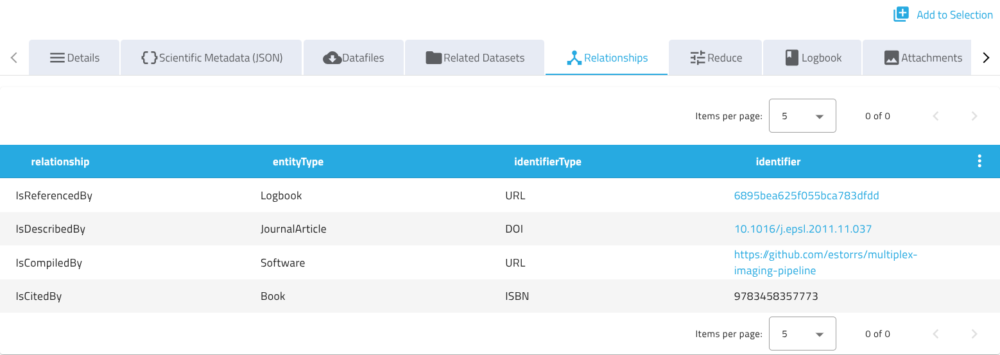

# Relationships

Datasets can store **relationships** to other entities, either other datasets in the same SciCat catalog or entities outside of it, e.g. a [SciLog](https://scilog.readthedocs.io) logbook entry, a journal article (via DOI) or an arXiv preprint. Previously, relationships could only point to other SciCat datasets; the schema was generalized to support external entities too, see [backend PR](https://github.com/SciCatProject/backend/pull/2661).

Relationships are displayed on the dataset detail page in a dedicated **Relationships** tab, see [frontend PR](https://github.com/SciCatProject/frontend/pull/2416).

The schema is inspired by DataCite's [relatedIdentifier](https://datacite-metadata-schema.readthedocs.io/en/4.7/properties/relatedidentifier/) property, where `identifierType` roughly corresponds to DataCite's `relatedIdentifierType`, `relationship` to `relationType`, and `entityType` to `resourceTypeGeneral`.

## Relationship fields

Each entry in a dataset's `relationships` array describes a link to one related entity:

| Field | Required | Default | Description |
| --- | --- | --- | --- |
| `identifier` | yes | - | Identifier of the related entity, e.g. `https://example.org/datasets/123`, `10.1016/j.epsl.2011.11.037`, `arXiv:0706.0001`. |
| `identifierType` | no | `Other` | Type of the `identifier`, e.g. `URL`, `DOI`, `arXiv`. `Local` may be used for SciCat-internal identifiers. |
| `relationship` | no | `IsReferencedBy` | Nature of the relationship between this dataset and the related entity, e.g. `IsReferencedBy`, `IsSupplementTo`, `IsCitedBy`. |
| `entityType` | no | `Other` | Type of the related entity, e.g. `Dataset`, `Logbook`. |
| `externalId` | no | - | Identifier of the related entity within its own external system. Not used for SciCat-internal relationships. |

If `identifierType` is set to `URL`, the `identifier` must be a valid URL, otherwise the request is rejected.

`Local` is currently just a naming convention, reserved for possible future support for linking SciCat-internal entities through `relationships`; it has no special handling today. Existing SciCat-internal links, e.g. to instruments or samples, are handled through the dataset's own `instrumentIds` and `sampleIds` fields, not through `relationships`.

## Viewing relationships in the UI

If enabled, the dataset detail page shows a **Relationships** tab listing all relationships of the dataset in a table, with client-side pagination and sorting. Identifiers of type `URL` or `DOI` are rendered as clickable links, other identifier types are shown as plain text.



The tab's visibility is controlled by the `datasetRelationshipsEnabled` frontend config key, see the [frontend configuration guide](../frontendconfig/index.md).

## Example usage

Relationships can be added or updated via `PATCH /api/v4/datasets/:pid`, for example to link a dataset to a SciLog logbook and a journal article:

```json
{
  "relationships": [
    {
      "identifier": "https://scilog.example.ch/logbooks/6895bea625f055bca783dfdd",
      "identifierType": "URL",
      "entityType": "Logbook",
      "externalId": "6895bea625f055bca783dfdd"
    },
    {
      "identifier": "10.1016/j.epsl.2011.11.037",
      "identifierType": "DOI",
      "entityType": "JournalArticle"
    }
  ]
}
```

Since `relationships` is an array, a `PATCH` request replaces the whole array rather than merging individual entries. If two clients patch it concurrently without coordination, one update can silently overwrite the other. To avoid this, send the `If-Unmodified-Since` header with the dataset's last known `updatedAt` timestamp: the backend enforces this precondition atomically and responds with `412 Precondition Failed` if the dataset was modified in the meantime, see [PR](https://github.com/SciCatProject/backend/pull/2685).
