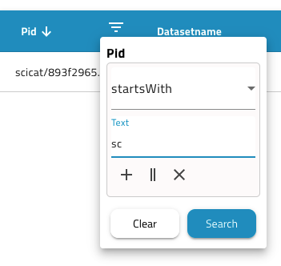

# Dashboard

SciCat's Dashboard or also sometimes called Landing Page is the first page that you see independent of whether you are logged in or not. If you want to login click *Sign in* on the top right button, see [here](./index.md) for more information. When set to datasets as main access point, it will show an overview of all datasets that you have access to. If you do not login you see those that are public. <!--Soon it will be possible to obtain this overview page for the other objects such as proposals, samples, published data and instruments. This can be configured by your site-admin.-->

SciCat offers now new features for viewing metadata as one likes with adjustable columns. 

You can change the columns to be shown by chosing from the three right dots "Column setting" and select those you would like. One can also drag columns by hovering over dots that appear just next to the label, click, pull it where you want it und release. 

One can

1. sort columns (click on the name and pull)
2. adjust width of columns (left block of dots)
3. remove or add columns (selection from Column settings)
4. invert order of display (click arrow next to the name)
5. apply a filter directly on that dataset with various options ("contains", "equals", "startsWith", "endsWith", "empty", "notEmpty") and either add (+), or (||) and exclude (x) another filter.

## Menu access to different information pages

You can always navigate to other parts of the application, simply by clicking on the user icon on the top right corner 

## Finding Datasets
SciCat provides several possibilities for finding the right datasets. One can use the top search bar, one can narrow down your selection by applying filters and/or conditions and the user can search on scientific metadata as well.

### Using Filters and Conditions

On the left one can apply most common filters. Currently there are

1. Location: location of creation of the dataset.
2. PID: Identifier of the dataset.
3. Groups: who owns the dataset.
4. Type: data type - e.g. raw data or derived data.
5. Keywords: tags added to the dataset.
6. Start - End Date: show datasets captured between the dates that you have set.
7. Text: which searches across dataset name and description.

The text fields provide an auto completion, which becomes visible as you type. 

You can click on the date calendar to select the start date and a second to select end date. Make sure you select 2 dates.

One can configure the selection of filters and add specific _conditions_. An example shows two additional conditions added:

## View Details
To view a dataset simply click on it in the table and a more detailed view will load (this is covered in the datasets section)

