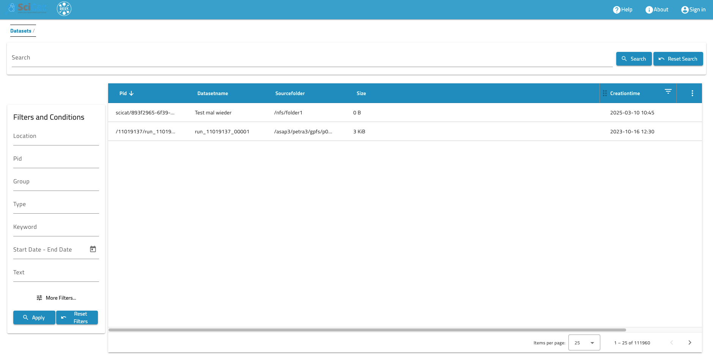
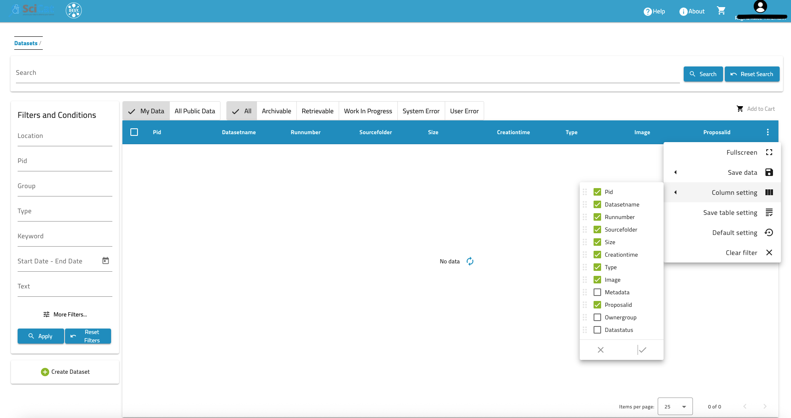
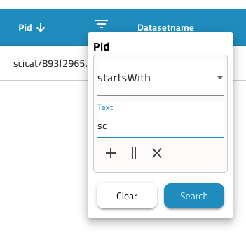
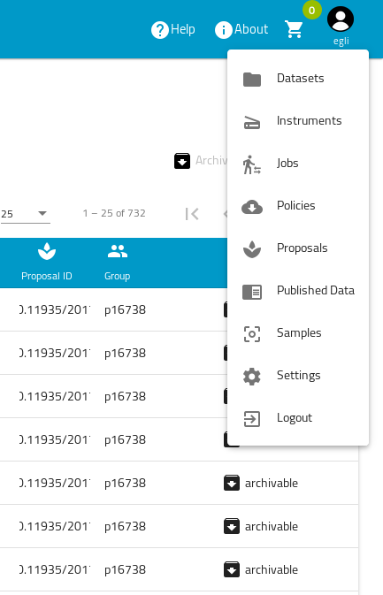

# Dashboard

SciCat's Dashboard or also sometimes called Landing Page is the first page that you see independent of whether you are logged in or not. If you want to login click *Sign in* on the top right button, see [here](./index.md) for more information. When set to datasets as main access point, it will show an overview of all datasets that you have access to. If you do not login you see those that are public. <!--Soon it will be possible to obtain this overview page for the other objects such as proposals, samples, published data and instruments. This can be configured by your site-admin.-->

SciCat offers now new features for viewing metadata as you like with adjustable columns. 

You can change the columns to be shown by chosing from the three right dots "Column setting" and select those you would like. You can also drag columns by hovering over dots that appear just next to the label, click and pull it where you want to place it, then release. 

You can

1. sort columns (click on the name and pull)
2. adjust width of columns (left block of dots)
3. remove or add columns (selection from Column settings)
4. invert order of display (click arrow next to the name)
5. apply a filter directly on that dataset with various options ("contains", "equals", "startsWith", "endsWith", "empty", "notEmpty") and either add (+), or (||) and exclude (x) another filter.

## Menu access to different information pages

You can always navigate to other parts of the application, simply by clicking on the user icon on the top right corner 

