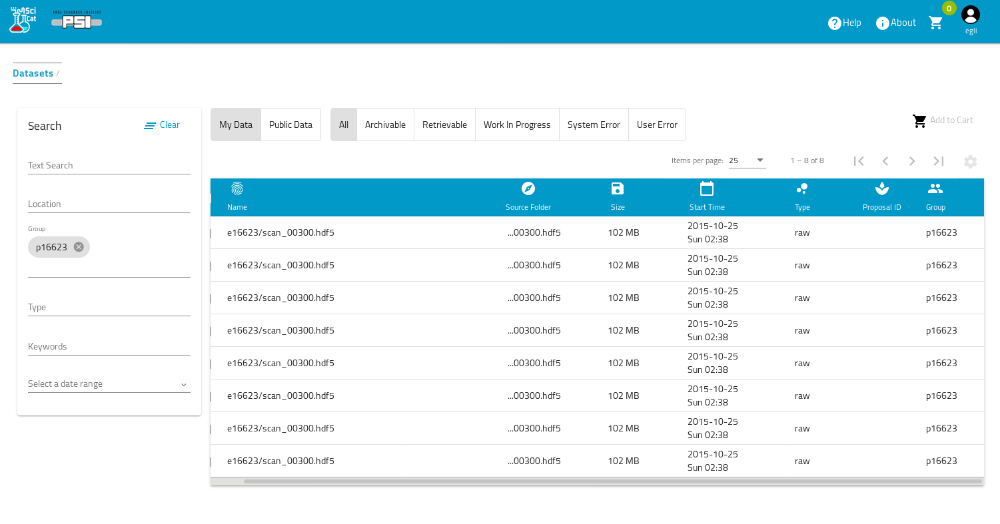
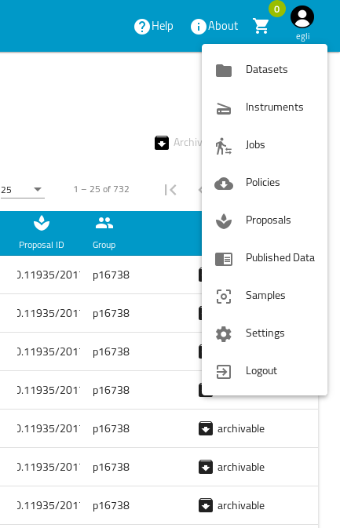

# Dashboard

The dashboard is the first page that you see when you are logged in. When set to datasets as main access point, it will show an overview of all datasets that you have access to. <!--Soon it will be possible to obtain this overview page for the other objects such as proposals, samples, published data and instruments. This can be configured by your site-admin.-->

## Menu access to different information pages

You can always navigate to other parts of the application, simply by clicking on the user icon on the top right corner 

## Finding Datasets
SciCat provides several possibilities for finding the right datasets. One can use the tob search bar, one can narrow down your selection by applying filters and/or conditions and the user can search on his scientific metadata as well.

### Using Filters and Conditions

On the left one can apply most common filters. Currently there are

1. Location: location of creation of the dataset.
2. PID: Identifier of the dataset.
3. Groups: who owns the dataset.
4. Type: data type - e.g. raw data or derived data.
5. Keywords: tags added to the dataset.
6. Start - End Date: show datasets captured between the dates that you have set.
7. Text: which searches across dataset name and description.

The text fields provide an auto completion, which becomes visible as you type. 

You can click on the date calendar to select the start date and a second to select end date. Make sure you select 2 dates.

One can configure the selection of filters and add specific _conditions_. An example shows two additional conditions added:

## Searching

The text field at the top of the navigation bar allows you to search the metadata for any word contained in the metadata (but not arbitrary substrings). The search starts automatically when to start to type in this textfield, so better type fast ;-) 

## Configure table columns

The cog wheel symbol on the top right allows to define the columns, that you want to see in the table

## View Details

To view a dataset simply click on it in the table and a more detailed view will load (this is covered in the next section)

