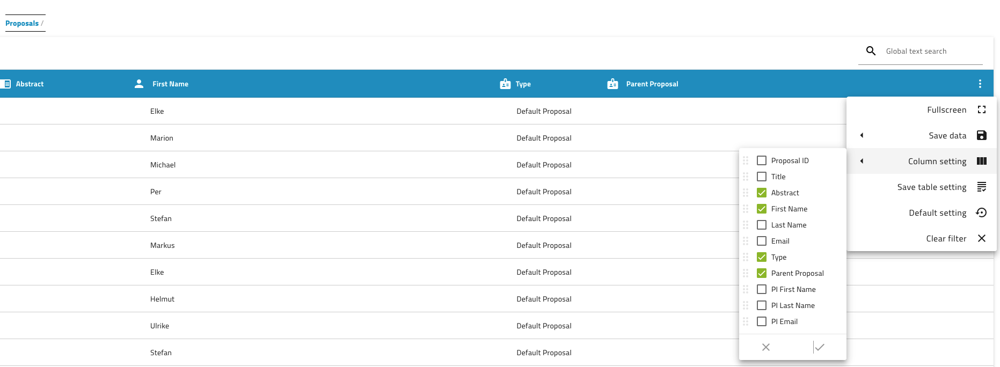

## Proposals

Proposals if entered can be listed as well (select from your login icon on top right *Proposals*). Now *parent proposals* can be handled and associated to your run number ID or beamtime id as *proposal ID* which is the child proposal of the parent proposal. 

With the new adjustable configurable table view one can select what to display and sort as well just like in datasets.

