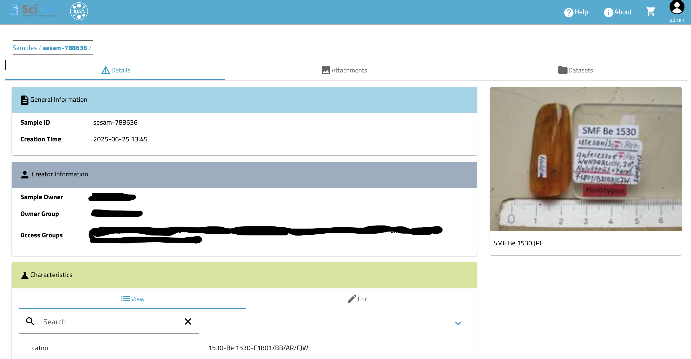

## Samples

If set up at your site you can list, search and view samples that have been entered into SciCat. This screenshot shows how to filter for specific characteristics of a sample:

When selecting a such sample one sees the details
