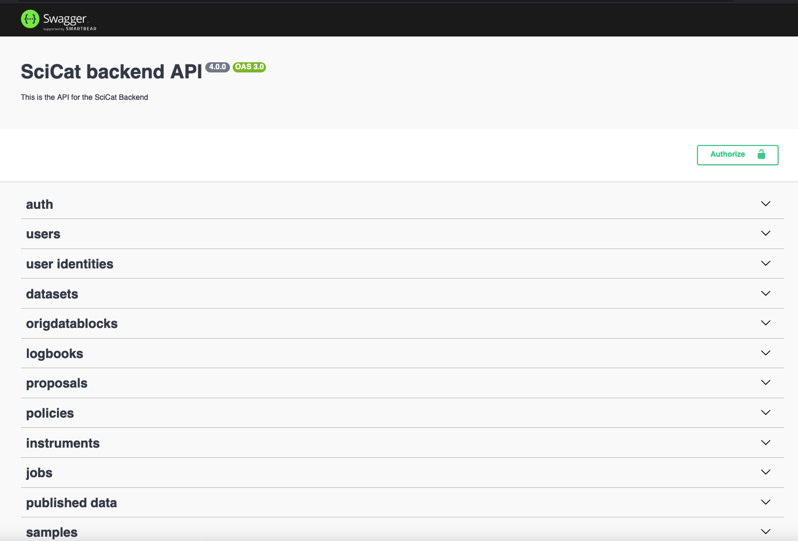
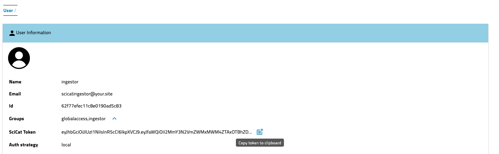
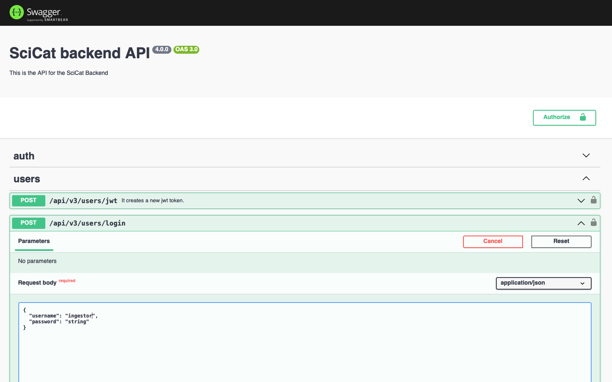
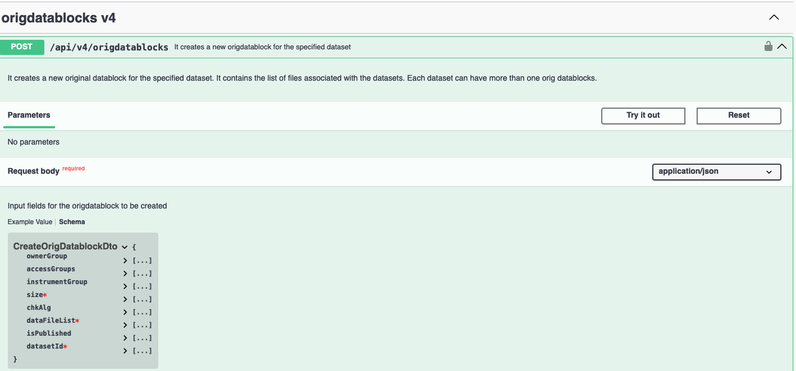

# Swagger - explore the Backend API

If SciCat has been set up and runs, one has direct access to the backend through the APIs via the Swagger tool or Explorer interface. Often, you can simply extend the ```url``` by ```/explorer```, e.g. ```https://myscicat.mydomain.de/explorer```. You will see a list of all APIs of that instance.




Once authenticated you can start using the endpoints.

## Authentication

You need to authenticate twice:
1. Get the **SciCat token** from the user setting when logged into SciCat via the main GUI. Copy paste it into the field "Authorize" in the explorer on the top right. 
<br>
<br>
2. Login on the explorer page again with the same credentials using the token. 

## Tips and Tricks

To see which fields are required check the "Schema" link next to the _Example Value_ in the **Response body** section. They are marked with a red asterisk.  


