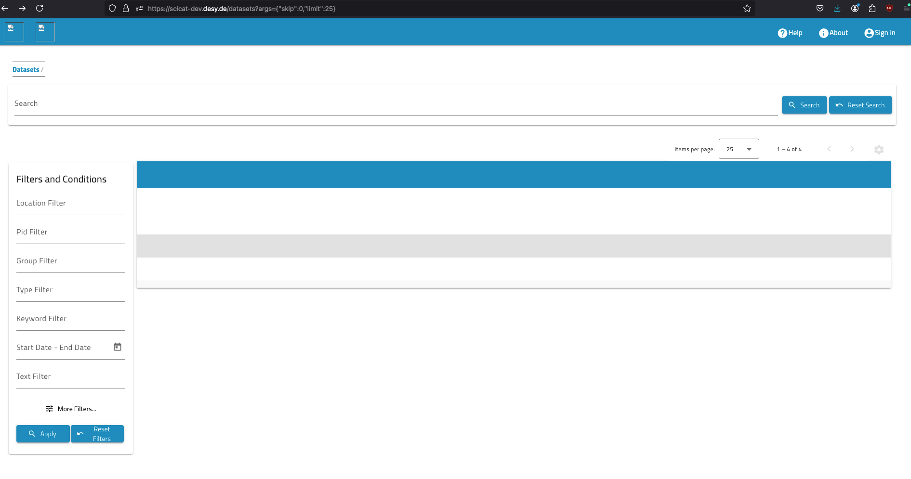

# Trouble shooting
When using SciCat it is possible you encounter unexpected things. Here is a list of what we had.
## #1 No images visible
Despite a working set up, sometimes no images are visible. The GUI may look like that:


This may to be related to the site-specific setup. Check with your site-administrator or  github issues. Indeed there was a bug in the release, a new version fixed it.

## #2 Admin/Ingestor login behaved differently

**Cause** emails in functionalAccounts.json can not be twice the same.

```db.getCollection("User").drop():```

delete _User table_ 

fix by deleting the dublicate and relaunch backend at restart. 


## #3 SciCat complains about non-standard PID

error message when trying an ingest of a dataset:

```Datasets": [], "usedSoftware": [], "relationships": []}
Scicat returned 400 Bad Request: PID is not following required standards
{'message': 'PID is not following required standards', 'error': 'Bad Request', 'statusCode': 400}```

Fix was in the variable : ```DATASET_CREATION_VALIDATION_REGEX``` if enabled with default values. Switch is ```DATASET_CREATION_VALIDATION_ENABLED```, see documentation of backend [here](https://github.com/SciCatProject/scicat-backend-next).