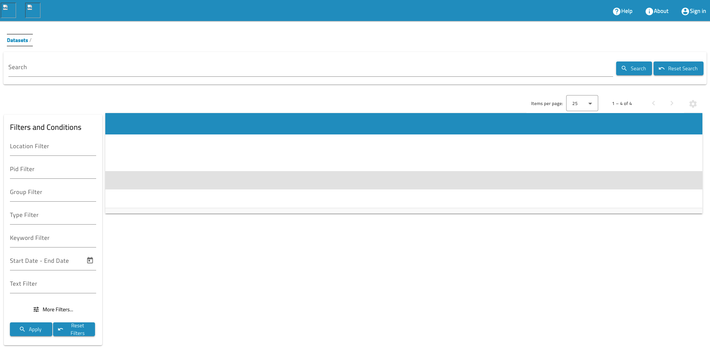

# Trouble shooting
When using SciCat it is possible you encounter unexpected things. Here is a list of what we had.
## #1 No images visible
Despite a working set up, sometimes no images are visible. The GUI may look like that:


This may to be related to the site-specific setup. Check with your site-administrator or  github issues. Indeed there was a bug in the release, a new version fixed it.

## #2 Admin/Ingestor login behaved differently

**Cause** emails in functionalAccounts.json can not be twice the same.

```db.getCollection("User").drop():```

delete _User table_ 

fix by deleting the dublicate and relaunch backend at restart. 